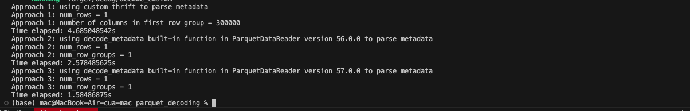

## Overview
`parquet_decoding` is a Rust implementation focused on efficient decoding and parsing of Apache Parquet metadata and data files. The project aims to provide high-performance tools for reading Parquet files, including deserialization of metadata and access to column statistics.

This library can be leveraged for building data processing applications that require working with Parquet format, such as analytics platforms and data pipelines.

Inspired by the new release of the Apache Arrow parquet Rust crate https://arrow.apache.org/blog/2025/10/23/rust-parquet-metadata/, which introduced a custom Thrift parser to decode Parquet metadata 3x-9x faster than earlier versions, I implemented a benchmark comparing the custom parser and the previous built-in decode_metadata function (version 56.x).
The experiment showed that the built-in decode_metadata function (version 57.0.0) indeed outperformed the earlier custom implementation in terms of speed, confirming the significant performance improvements made in the latest release.

## Performance Comparision

