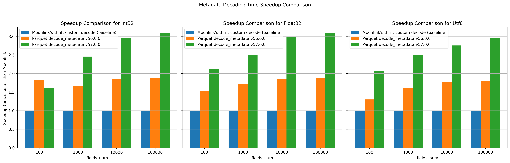

## Overview
`parquet_decoding` is a Rust implementation focused on efficient decoding and parsing of Apache Parquet metadata and data files. The project aims to provide high-performance tools for reading Parquet files, including deserialization of metadata and access to column statistics.

This library can be leveraged for building data processing applications that require working with Parquet format, such as analytics platforms and data pipelines.

Inspired by the new release of the [Apache Arrow Parquet Rust crate](https://arrow.apache.org/blog/2025/10/23/rust-parquet-metadata/), which introduced a custom Thrift parser that decodes Parquet metadata 3x–9x faster than earlier versions, I implemented a benchmark comparing Moonlink’s custom parser [Moonlink parquet_utils.rs](https://github.com/Mooncake-Labs/moonlink/blob/main/src/moonlink_backend/src/parquet_utils.rs)  with the built-in decode_metadata function of Parquet (versions 56.x and 57.0.0).
The experiment showed that the built-in decode_metadata function in Parquet version 57.0.0 indeed outperformed both version 56.0.0 and Moonlink’s custom Thrift parser implementation in terms of speed, confirming the significant performance improvements made in the latest release.

## Performance Comparision

## Detailed Performance Comparision:
|   fields_num | data_type   |   avg_time_moonlink_thrift_custom_s |   avg_time_parquet56_s |   avg_time_parquet57_s |
|-------------:|:------------|------------------------------------:|-----------------------:|-----------------------:|
|          100 | Int32       |                          0.00236261 |             0.001302   |             0.00146025 |
|          100 | Float32     |                          0.00317492 |             0.00207054 |             0.00149006 |
|          100 | Utf8        |                          0.00311334 |             0.00239406 |             0.0015105  |
|         1000 | Int32       |                          0.0232568  |             0.0140611  |             0.00946907 |
|         1000 | Float32     |                          0.0234623  |             0.0137133  |             0.00937064 |
|         1000 | Utf8        |                          0.0241265  |             0.0149411  |             0.00967522 |
|        10000 | Int32       |                          0.238312   |             0.12896    |             0.0804334  |
|        10000 | Float32     |                          0.237675   |             0.128487   |             0.0799911  |
|        10000 | Utf8        |                          0.244199   |             0.137058   |             0.088716   |
|       100000 | Int32       |                          2.45873    |             1.30495    |             0.795224   |
|       100000 | Float32     |                          2.45601    |             1.30331    |             0.794181   |
|       100000 | Utf8        |                          2.54121    |             1.41003    |             0.86321    |

[detailed_comparision](parquet_decoding_benchmark_plotting/detailed_comparision.md)

## Project Set-up step by step
There are 2 sub-project
1. benchmark processing which are written by RUST
[benchmark process re-producing](parquet_decoding_benchmark_processing/README.MD)

2. benchmark plotting by python
[benchmark plot re-producing](parquet_decoding_benchmark_plotting/README.MD)

